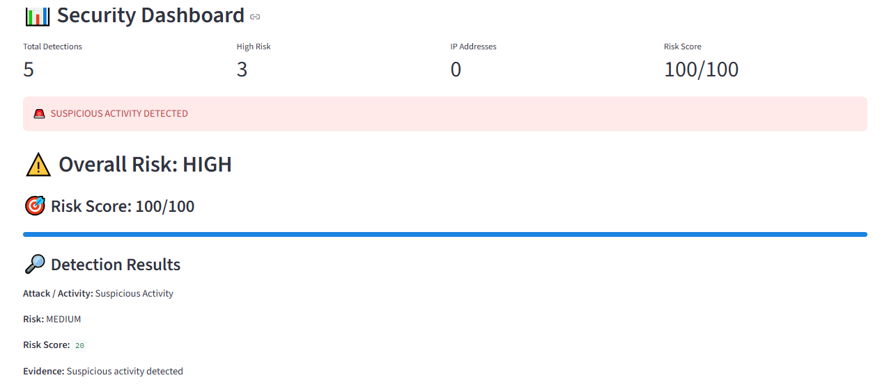
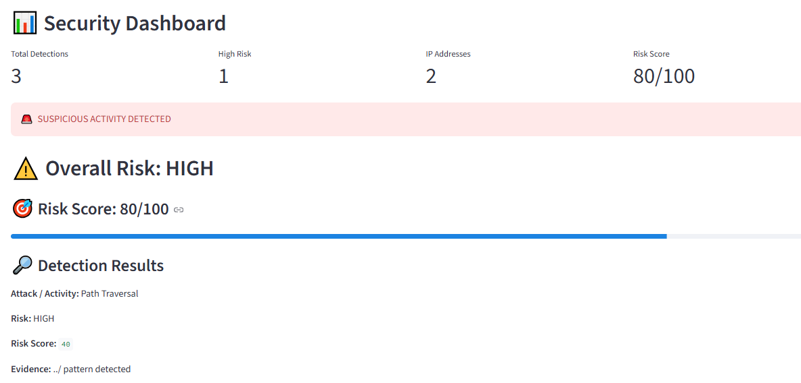
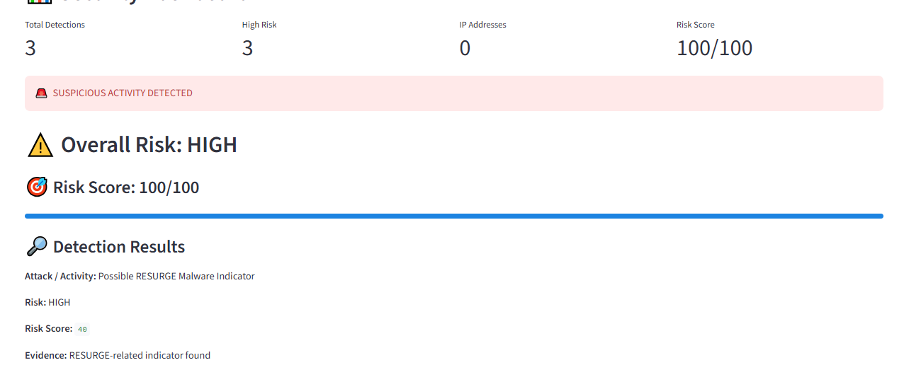
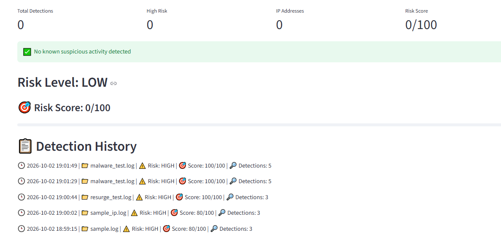

# VulnGuard – Malware, Vulnerability & Attack Detection Tool
VulnGuard is a Python and Streamlit based defensive log-analysis tool designed to detect suspicious attack and malware-related indicators from security logs.
## Case Study
This project is based on the RESURGE malware case associated with CVE-2025-0282 affecting Ivanti Connect Secure.
### Case Study Details
- **CVE:** CVE-2025-0282
- **Affected Product:** Ivanti Connect Secure
- **Vulnerability:** Stack-Based Buffer Overflow
- **Initial Access:** Unauthenticated Exploitation
- **Impact:** Remote Code Execution
- Observed Behaviours: File manipulation, integrity-check manipulation, SSH tunneling and web-shell activity
Objectives
- Analyse security log files
- Detect suspicious attack indicators
- Detect malware-related behaviour
- Extract IP-based Indicators of Compromise (IOCs)
- Calculate a risk score
- Provide explainable detection results and recommendations
Technologies Used
- Python
- Streamlit
- Regular Expressions
- Pattern Matching
- Session State
Detection Capabilities
VulnGuard can detect indicators such as:
- Path Traversal
- Failed Login Activity
- Malware Activity
- Web Shell Behaviour
- SSH Tunneling
- Suspicious File Modification
- RESURGE-related indicators
- Boot Disk Manipulation
- Integrity Check Manipulation
- IP-based IOC extraction
Testing
Testing was performed using simulated security log files:
- normal_test.log
- sample_ip.log
- malware_test.log
- resurge_test.log
No real attack was performed. The logs were created for safe testing of the detection rules.
Risk Assessment
VulnGuard calculates a risk score based on detected indicators.
- LOW: Low-risk or no suspicious activity
- MEDIUM: Suspicious activity detected
- HIGH: Multiple or high-risk indicators detected
- ## 📸 Screenshots

### Security Dashboard

### Sample IP Detection

### RESURGE Detection

### Normal Log Result

